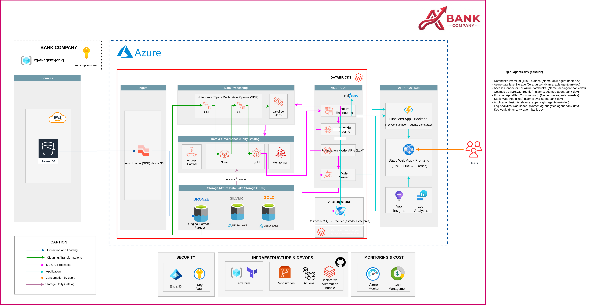

## ADR-18 · El agente corre en la Function App  ·  rol: ia-ml  ·  2026-09-29  ·  estado: cerrada

**Decisión.** El grafo LangGraph (ADR-01) corre compilado dentro de la Function App Flex Consumption; Databricks aporta Foundation Model APIs, Model Serving y MLflow, no un Agent Framework.

Reparto:

| Componente | Dónde corre | Contrato |
| --- | --- | --- |
| Grafo Understand → Decide → Act → Verify → Escalate → Respond, policy engine, tools | Function App Flex Consumption (python3.11) | `infra.yaml` `agent_runtime` |
| `POST /chat`, `POST /chat/confirm`, `GET /trace/{trace_id}`, `GET /handoff/{case_id}`, `GET /healthz` | misma Function App | `api.yaml` (sin cambio) |
| `POST /session` | la define servicio (ADR-12 cerrada: JWT HS256) | `api.yaml` |
| LLM: Claude Sonnet (`FM_ENDPOINT_MAIN`), Llama 8B (`FM_ENDPOINT_SMALL`) | Databricks Foundation Model APIs | `infra.fm_apis`, ADR-02 |
| Pre-score LightGBM (`PRESCORE_ENDPOINT`) | Databricks Model Serving scale-to-zero | `infra.model_serving`, ADR-06 |
| Trazas | MLflow Tracing (`MLFLOW_TRACKING_URI=databricks`, experimento `/Shared/fh26/agente`) + App Insights; `trace_id` = `operation_id` | `ops.agent_turns`, ADR-15 |
| Prompts | `agent/prompts/` versionado en el repo; hash en cada traza (`prompt_version`) | `agent.prompts` |

La Function App accede a Databricks con `sp-agent-ro`. Permisos: `SELECT` sobre `hackathon.gold` y `hackathon.ref`, y `CAN_EDIT` solo sobre el experimento `/Shared/fh26/agente`. No tiene escritura en datos.

| Alternativas descartadas | Por qué |
| --- | --- |
| Mosaic AI Agent Framework (`databricks-agents`, `agents.deploy`, agente como endpoint de Model Serving) | Segundo runtime detrás de la API; endpoint de agente con costo y cold start propios; más saltos por turno; empaquetado y deploy distintos al resto del backend |
| Agent Bricks | Agente declarativo; no expone el grafo ni el policy engine determinista (ADR-01, ADR-05); menos control del punto de abstención |
| MLflow Prompt Registry | No hace falta en el hackathon: el repo + hash en la traza da versión y auditoría |
| Function App Consumption (v1 del contrato) | Se usa Flex Consumption, como en el diagrama de servicio |

**Impacto.**

| Elemento | Estado | Owner | Consumers afectados | Qué deben hacer | Fecha límite |
| --- | --- | --- | --- | --- | --- |
| `infra.function_app_settings` (`infra.yaml` v1 → v2) | cambia: `FM_ENDPOINT` → `FM_ENDPOINT_MAIN` + `FM_ENDPOINT_SMALL`; + `MLFLOW_TRACKING_URI=databricks`; `MLFLOW_EXPERIMENT=/Shared/fh26/agente` | servicio | servicio, ia-ml | Nicolle: crear App Settings y aprobar | Mié 30, antes de Integración 1 |
| `infra.function_app` | nuevo en impact-map; plan Consumption → Flex Consumption | servicio | ia-ml | Nicolle: Function App en Flex Consumption | Mié 30, antes de Integración 1 |
| `infra.fm_apis` | existe; alineado con `infra.yaml` | ia-ml | servicio | Nicolle: cada setting a su endpoint | Mié 30 |
| `infra.databricks_access` | cambia: `sp-agent-ro` `CAN_EDIT` solo sobre `/Shared/fh26/agente` | datos | ia-ml, servicio | Eladio: conceder permiso | Mié 30 mañana |
| `agent.runtime` | nuevo | ia-ml | servicio | Nicolle: empaquetar `agent/` en el deploy | Mié 30 (M6) |
| `agent.prompts` | nuevo | ia-ml | — | — | — |
| `api.*` | existe, sin cambio | ia-ml | servicio | nada | — |
| Alerta p95 (`ops.yaml` v1 → v2) | cambia: p95 ≤ 8000 ms solo con `cold_start = false`; cold start aparte | servicio | servicio, datos | Nicolle: filtrar alerta. Eladio: separar en tablero AI/BI | Vie 2 |
| `eval.cases` + CI | cambia: smoke en `func start` y en Function App; test sin `databricks-agents` | ia-ml | servicio | Nicolle: job CI post-deploy (N8) | Vie 2 |

**Cómo se prueba.**

| Prueba | Umbral | Dónde se registra |
| --- | --- | --- |
| Mismo `eval/cases.jsonl` en `func start` y en la Function App desplegada | matriz de confusión de acción igual en ambos (misma acción por caso) | MLflow (experimento `/Shared/fh26/agente`) + CI |
| Test de imports: el paquete de la Function App no importa `databricks-agents` | 0 imports | CI (pytest) |
| Groundedness y cita a chunk o regla (ADR-08) | sin cambio | MLflow + `ops.agent_turns.groundedness` |
| Latencia p95 por turno, en caliente | ≤ 8 s, por idioma ES/PT | `ops.agent_turns.latency_ms` ⋈ `ops.infra_requests.cold_start = false`; alerta en `ops.yaml` |
| Cold start | se reporta aparte (p50/p95/conteo); no cuenta para el umbral | `ops.infra_requests.cold_start` |
| Costo por caso | tokens FM + DBU Model Serving + ejecución Function; estimación por 7 días | `ops.agent_turns.cost_usd` + N7 |
| Trazas llegan a MLflow desde Azure | 100 % de turnos con `trace_id` y `prompt_version` | `ops.agent_turns` |

Baseline y split: mismo eval set held-out ES/PT de ADR-10. Sin baseline nuevo: es una decisión de runtime, no de modelo.

Política y scopes: sin cambio. El policy engine corre en proceso, en el nodo Decide.

**Hackathon vs To-Be.**

| Hackathon | To-Be |
| --- | --- |
| Grafo LangGraph en la Function App Flex Consumption | Agente en Mosaic AI Agent Framework (`agents.deploy`, Review App) o Agent Bricks, evaluado contra este baseline |
| Prompts en `agent/prompts/` + hash en traza | MLflow Prompt Registry con alias por entorno |
| Estado en Cosmos free tier (ADR-09) | Lakebase |
| Cold start reportado aparte | Instancias always-ready de Flex Consumption si el cold start afecta a producción |
| `sp-agent-ro` con `CAN_EDIT` en un experimento | Service principal de escritura de trazas separado del de lectura de datos |

**Dependencias.**

| # | Entregable | De → para | Formato | Fecha | Mock |
| --- | --- | --- | --- | --- | --- |
| N2 (cambia) | Function App Flex Consumption + App Settings de `infra.yaml` v2 | Nicolle → Manuela | Azure + App Settings | Mié 30 mañana | `func start` + `local.settings.json` |
| X1 (cambia) | + `CAN_EDIT` de `sp-agent-ro` sobre `/Shared/fh26/agente` | Eladio → Nicolle, Manuela | permiso de experimento MLflow | Mié 30 mañana | experimento personal de Manuela |
| M6 (cambia) | `/agent handle(message, session)`: grafo compilado, sin `databricks-agents`, prompts con hash + tests | Manuela → Nicolle | módulo Python | Mié 30 | — |
| N8 (nueva) | Job CI post-deploy: smoke `/chat` con subconjunto de `eval/cases.jsonl`; p95 en caliente vs cold start | Nicolle → Manuela | GitHub Actions | Vie 2 | `func start` local |
| X3 (cambia) | Tablero AI/BI con p95 en caliente y cold start por separado | Nicolle → Eladio | AI/BI | Vie 2 | — |

**Base regulatoria.** No aplica. Ningún dato del dataset sale del tenant: LLM, pre-score y trazas quedan en Databricks; la Function App y Cosmos quedan en la suscripción del equipo.
